# I Built an AI-Powered Second Brain — Here's the Full Architecture

**I was drowning in my own knowledge.**

Hundreds of bookmarks scattered across Chrome, Firefox, and Safari. Notes fragmented between Notion, Apple Notes, and random `.txt` files. Tweets I'd saved but could never find again. Articles I'd read but couldn't recall when I needed them most.

Sound familiar?

I realized I didn't have a *knowledge problem* — I had a **retrieval problem**. I could capture information just fine. But when I actually needed something I'd saved three months ago? Gone. Buried. Irretrievable.

So I built **Mindweave** — an AI-powered personal knowledge hub that doesn't just store your ideas, it *understands* them. You can ask it questions in plain English, and it finds answers from your own knowledge base using semantic search and RAG (Retrieval-Augmented Generation).

This post is a technical deep-dive into how I architected it — from database schema to deployment pipeline — and the engineering decisions behind every layer.

---

## What Mindweave Does

Before diving into the architecture, here's what the product actually does:

- **Capture anything** — Notes, links, files. From the web app, browser extension, or mobile app.
- **AI auto-tags and summarizes** everything you save — no manual organization needed.
- **Semantic search** — Find content by *meaning*, not just keywords. Search "that article about microservices scaling" and it finds it, even if those exact words don't appear.
- **Knowledge Q&A** — Ask your knowledge base questions like "What were the key takeaways from that system design article?" and get cited answers.
- **Content recommendations** — "View Similar" surfaces related content you forgot you saved.
- **Advanced analytics** — Visualize your knowledge patterns, gaps, and growth over time.

---

## System Architecture Overview

Here's the high-level architecture:

```mermaid
graph TB
    subgraph CLIENT["🖥️ Client Layer"]
        PWA["Next.js PWA<br/><i>React 18 + TypeScript</i>"]
        EXT["Chrome Extension<br/><i>Manifest V3</i>"]
        MOB["Mobile Apps<br/><i>iOS & Android (Capacitor)</i>"]
    end

    subgraph APP["⚙️ Application Layer — Next.js 15 App Router"]
        SA["Server Actions"]
        API["REST API Routes"]
        MW["Middleware<br/><i>Auth + Rate Limiting</i>"]

        subgraph SERVICES["Service Layer"]
            CS["Content<br/>Service"]
            ES["Embedding<br/>Service"]
            CLS["Clustering<br/>Service"]
            AS["Analytics<br/>Service"]
        end
    end

    subgraph DATA["💾 Data Layer"]
        DB[("PostgreSQL 16<br/>+ pgvector<br/><br/>• Content<br/>• Embeddings<br/>• Collections<br/>• Users/Sessions<br/>• Tasks/Feedback")]

        subgraph AI["🤖 AI Services"]
            GEM["Google Gemini<br/><i>Embeddings (768d)</i><br/><i>text-embedding-004</i>"]
            CLAUDE["Anthropic Claude<br/><i>Auto-tagging</i><br/><i>Summarization</i><br/><i>Q&A (RAG)</i><br/><i>Insights</i>"]
        end
    end

    PWA --> SA & API
    EXT --> API
    MOB --> SA & API
    SA --> MW
    API --> MW
    MW --> SERVICES
    CS & ES & CLS & AS --> DB
    ES & CLS --> GEM
    CS & CLS & AS --> CLAUDE

    style CLIENT fill:#e0f2fe,stroke:#0284c7,stroke-width:2px,color:#000
    style APP fill:#f0fdf4,stroke:#16a34a,stroke-width:2px,color:#000
    style DATA fill:#fef3c7,stroke:#d97706,stroke-width:2px,color:#000
    style AI fill:#fce7f3,stroke:#db2777,stroke-width:2px,color:#000
    style SERVICES fill:#ecfdf5,stroke:#10b981,stroke-width:1px,color:#000
```



Let me break down each layer.

---

## The Database: PostgreSQL + pgvector

The database schema is the backbone. I chose **PostgreSQL 16** with the **pgvector extension** — this lets me store AI-generated vector embeddings right alongside relational data, no separate vector database needed.

### Schema Design


**Key design decisions:**

1. **Tags as PostgreSQL arrays** — Both `tags` (user-defined) and `autoTags` (AI-generated) are stored as native PostgreSQL text arrays. This enables `UNNEST`-based searching across array elements while keeping the schema flat. No join tables for tags.

2. **JSONB metadata** — The `metadata` column stores flexible data like `fileType`, `fileSize`, `filePath`, `favicon`, and `domain`. This avoids schema bloat for type-specific fields while keeping things queryable.

3. **Embeddings alongside content** — Instead of a separate vector database (Pinecone, Weaviate, etc.), I use pgvector's `vector(768)` column. One database, one connection, one transaction boundary. The tradeoff is scale — pgvector handles millions of vectors well, but if you need billions, you'd want a dedicated solution.

4. **Composite indexes** for common query patterns: `(userId, createdAt)`, `(userId, type)`, `(userId, isFavorite)`. These keep the library page snappy even with thousands of items.

5. **Cryptographic share IDs** — Content sharing uses `randomBytes(12).toString('base64url')` to generate 16-character share IDs. No sequential IDs, no guessable URLs.

### Why Not a Separate Vector DB?

I evaluated Pinecone and Weaviate early on. Here's why I stuck with pgvector:

- **Simplicity** — One database to manage, backup, and deploy. No additional service to maintain.
- **Transactional consistency** — Content and embeddings are created in the same transaction context. No sync issues.
- **Cost** — pgvector is free. Managed vector DBs charge per query/storage.
- **Good enough scale** — For a personal knowledge hub with thousands to tens of thousands of items, pgvector is more than sufficient. Cosine similarity search with the `<=>` operator returns results in milliseconds.

---

## The AI Pipeline: From Capture to Intelligence

This is where Mindweave goes from "another notes app" to a genuine second brain. Every piece of content flows through a multi-stage AI pipeline:

```mermaid
flowchart TD
    A["📝 User saves content"] --> B{"🔍 Zod Schema\nValidation"}
    B -->|Valid| C["💾 Save to Database\n<i>(immediate — user sees success)</i>"]
    B -->|Invalid| ERR["❌ Return validation errors"]

    C --> D["⚡ Trigger Parallel AI Operations\n<i>(non-blocking, async)</i>"]

    D --> E["🏷️ Generate Auto-Tags\n<b>Claude Sonnet</b>\n→ 3-5 tags per item"]
    D --> F["📋 Generate Summary\n<b>Claude Haiku</b>\n→ 1-2 sentence summary"]
    D --> G["🧮 Generate Embedding\n<b>Gemini text-embedding-004</b>\n→ 768-dimensional vector"]

    E --> H["✅ Update content record\nwith AI enrichments"]
    F --> H
    G --> I["✅ Store in embeddings table"]

    style A fill:#dbeafe,stroke:#2563eb,stroke-width:2px,color:#000
    style C fill:#d1fae5,stroke:#059669,stroke-width:2px,color:#000
    style D fill:#fef3c7,stroke:#d97706,stroke-width:2px,color:#000
    style E fill:#fce7f3,stroke:#db2777,color:#000
    style F fill:#fce7f3,stroke:#db2777,color:#000
    style G fill:#e0e7ff,stroke:#4f46e5,color:#000
    style ERR fill:#fee2e2,stroke:#dc2626,color:#000
```



> **Key insight**: Content is saved instantly. The user never waits for AI processing — tagging, summarization, and embedding generation all happen asynchronously after the database write.

### The Two-AI Architecture

I deliberately split AI responsibilities across two providers:

**Google Gemini** handles embeddings:
- Model: `text-embedding-004`
- Output: 768-dimensional vectors
- Input: Concatenated `title + body + tags + autoTags` (up to 10,000 chars)
- Used for: Semantic search, content recommendations, clustering

**Anthropic Claude** handles language intelligence:
- `claude-3-5-sonnet` for tag generation (needs nuanced understanding) and Q&A (needs reasoning)
- `claude-3-5-haiku` for summarization (simpler task, faster/cheaper model)

**Why two models?** Cost optimization and playing to each model's strengths. Gemini's embedding model is excellent and cost-effective. Claude excels at nuanced language tasks like generating meaningful tags and answering questions with citations.

### Semantic Search: How It Works

When a user searches "that article about microservices scaling," here's what happens:

```mermaid
flowchart LR
    A["🔎 User Query\n<i>'microservices scaling patterns'</i>"] --> B["🧮 Gemini\ntext-embedding-004\n<i>Convert to 768d vector</i>"]
    B --> C["⚡ pgvector\nCosine Similarity\n<i>embedding <=> query_vec</i>"]
    C --> D["📊 Ranked Results\n<i>Sorted by similarity\n0.0 → 1.0</i>"]

    style A fill:#dbeafe,stroke:#2563eb,stroke-width:2px,color:#000
    style B fill:#e0e7ff,stroke:#4f46e5,stroke-width:2px,color:#000
    style C fill:#fef3c7,stroke:#d97706,stroke-width:2px,color:#000
    style D fill:#d1fae5,stroke:#059669,stroke-width:2px,color:#000
```



The SQL under the hood:
```sql
SELECT *, 1 - (embedding <=> $1) AS similarity
FROM embeddings
JOIN content ON content.id = embeddings."contentId"
WHERE content."userId" = $2
ORDER BY embedding <=> $1
LIMIT 20;
```

The magic: `"scaling microservices"` matches `"distributed system growth"` because their vectors are close in 768-dimensional space — even though they share zero keywords.

### Knowledge Q&A: RAG Pipeline

The "Ask your knowledge base" feature uses a full RAG (Retrieval-Augmented Generation) pipeline:

```mermaid
flowchart TD
    Q["❓ User Question\n<i>'What did I learn about\ncaching strategies?'</i>"] --> R

    subgraph RAG["RAG Pipeline"]
        direction TB
        R["1️⃣ RETRIEVE\nSemantic search → top 10\nmost relevant items from\nuser's knowledge base"]
        R --> A2["2️⃣ AUGMENT\nBuild prompt with context:\n<i>'Based on these sources:\n[1] Redis patterns...\n[2] CDN caching...\n[3] HTTP cache headers...'</i>"]
        A2 --> G["3️⃣ GENERATE\n<b>Claude Sonnet</b>\nGenerates answer with\nnumbered citations"]
    end

    G --> OUT["💬 Answer\n<i>'According to your note [1],\nyou learned that Redis is ideal for...\nYour bookmark [2] also mentions...'</i>"]

    style Q fill:#dbeafe,stroke:#2563eb,stroke-width:2px,color:#000
    style R fill:#e0e7ff,stroke:#4f46e5,color:#000
    style A2 fill:#fef3c7,stroke:#d97706,color:#000
    style G fill:#fce7f3,stroke:#db2777,color:#000
    style OUT fill:#d1fae5,stroke:#059669,stroke-width:2px,color:#000
    style RAG fill:#f8fafc,stroke:#94a3b8,stroke-width:1px,color:#000
```



### Advanced AI Features

Beyond search and Q&A, Mindweave uses AI for several more capabilities:

**Content Clustering** — A custom K-means++ implementation groups similar content together using embedding vectors. Euclidean distance with weighted random centroid initialization ensures quality clusters. Claude then generates meaningful names for each cluster (e.g., "System Design Patterns", "Career Growth Notes").

**Key Insights** — Analyzes tag co-occurrence patterns (using PostgreSQL `UNNEST` on arrays), creation patterns (weekday distribution, content type preferences), and knowledge gaps (emerging topics with fewer than 3 items). All four analyses run in parallel for performance.

**Smart Search Suggestions** — Context-aware query suggestions based on your content patterns, with typo correction.

---

## Authentication & Security

Security was not an afterthought. Here's the full auth architecture:

```mermaid
flowchart TD
    subgraph CLIENT["🖥️ Client (Browser)"]
        OAUTH["Google OAuth\nButton"]
        CREDS["Email / Password\nForm"]
        TURN["🛡️ Cloudflare\nTurnstile Widget"]
    end

    OAUTH --> AUTH
    CREDS --> TURN
    TURN -->|"Token attached"| AUTH

    subgraph AUTH["⚙️ Auth.js v5 (Server-Side)"]
        S1["1. Verify Turnstile token\n<i>Server-side API call to Cloudflare</i>"]
        S2["2. Authenticate\n<i>OAuth flow OR bcrypt check</i>"]
        S3["3. Issue JWT session\n<i>Edge Runtime compatible</i>"]
        S4["4. Set secure HTTP-only cookie"]
        S1 --> S2 --> S3 --> S4
    end

    S4 --> DASH["✅ Dashboard Access"]

    style CLIENT fill:#e0f2fe,stroke:#0284c7,stroke-width:2px,color:#000
    style AUTH fill:#f0fdf4,stroke:#16a34a,stroke-width:2px,color:#000
    style TURN fill:#fef3c7,stroke:#d97706,color:#000
    style DASH fill:#d1fae5,stroke:#059669,stroke-width:2px,color:#000
```



**8 layers of security**, not bolted on — baked in:

| Layer | Implementation |
|-------|---------------|
| Bot protection | Cloudflare Turnstile (invisible CAPTCHA) |
| Password hashing | bcryptjs with salt rounds |
| Session strategy | JWT (not DB sessions) for Edge Runtime |
| Rate limiting | 10 auth attempts per 15 minutes |
| Email verification | Token-based, required for new accounts |
| Password reset | Tokenized email links via Resend |
| CSRF protection | Built-in via Auth.js |
| Security headers | CSP, HSTS, X-Frame-Options, X-Content-Type-Options |

### Rate Limiting

Every endpoint is rate-limited:

| Endpoint | Limit | Window |
|----------|-------|--------|
| General API | 100 requests | 1 minute |
| File upload | 20 requests | 1 hour |
| Import | 5 requests | 1 hour |
| Auth attempts | 10 requests | 15 minutes |

Rate limit headers (`X-RateLimit-Remaining`, `Retry-After`) are included in every response.

### File Upload Security

File uploads use **magic byte validation** — the server reads the actual binary header of uploaded files to verify they match the claimed MIME type. This prevents MIME type spoofing attacks where someone uploads a `.jpg` that's actually a `.php` script.

---

## The Full-Stack: Frontend to Deployment

### Frontend Architecture


**Key frontend decisions:**

- **Server Components by default** — Only add `"use client"` when interactivity is needed. This keeps the JS bundle small and initial page loads fast.
- **URL parameter persistence** — Filters, search queries, and sort order are stored in URL params. This means you can share a filtered library view, and hitting the back button works as expected.
- **300ms debounced search** — The search bar waits 300ms after the user stops typing before firing a query. This prevents hammering the database on every keystroke.
- **Cursor-based pagination** — The library uses cursor-based (not offset-based) pagination for infinite scroll. This is more efficient and handles new items being added while scrolling.

### Browser Extension

A Chrome extension (Manifest V3) lets users save any webpage with one click:

```mermaid
sequenceDiagram
    actor U as User
    participant EXT as Chrome Extension<br/>(Manifest V3)
    participant API as Mindweave API
    participant AI as AI Pipeline

    U->>EXT: Click extension icon
    EXT->>API: GET /api/extension/session
    API-->>EXT: Session valid ✅

    Note over EXT: Show popup with<br/>page title & URL pre-filled

    U->>EXT: Add tags (optional) → Save
    EXT->>API: POST /api/extension/capture
    API-->>EXT: Content saved ✅
    API--)AI: Async: tags + summary + embedding

    Note over EXT: Auth: cookie-based<br/>Permissions: activeTab only
```



### Mobile Apps & PWA

Mindweave reaches users on every platform:

```mermaid
graph LR
    subgraph WEB["🌐 Web"]
        PWA["Progressive Web App\n<i>Serwist service worker</i>\n<i>Offline caching</i>\n<i>Install prompt</i>\n<i>App shortcuts</i>"]
    end

    subgraph MOBILE["📱 Native Mobile"]
        IOS["iOS App\n<i>Capacitor</i>\n<i>App Store</i>"]
        ANDROID["Android App\n<i>Capacitor</i>\n<i>Google Play</i>"]
    end

    subgraph EXT2["🧩 Browser"]
        CHROME["Chrome Extension\n<i>Manifest V3</i>\n<i>One-click save</i>"]
    end

    subgraph FEATURES["Native Capabilities"]
        direction TB
        F1["Push Notifications"]
        F2["Deep Linking\n<i>mindweave://</i>"]
        F3["Share Intent\n<i>Receive from other apps</i>"]
        F4["Offline Access"]
    end

    IOS & ANDROID --> FEATURES
    PWA --> F4

    style WEB fill:#dbeafe,stroke:#2563eb,stroke-width:2px,color:#000
    style MOBILE fill:#d1fae5,stroke:#059669,stroke-width:2px,color:#000
    style EXT2 fill:#fef3c7,stroke:#d97706,stroke-width:2px,color:#000
    style FEATURES fill:#f3e8ff,stroke:#9333ea,stroke-width:2px,color:#000
```



---

## Deployment Architecture

Mindweave runs on **Google Cloud Platform** with a fully automated CI/CD pipeline:

```mermaid
flowchart TD
    GIT["🚀 git push origin main"] --> CB

    subgraph CB["Google Cloud Build"]
        B1["1. Build Docker Image\n<i>Multi-stage: node:20-alpine</i>\n<i>deps → build → runner</i>"]
        B2["2. Push to GCR\n<i>gcr.io/PROJECT/mindweave</i>"]
        B3["3. Deploy to Cloud Run"]
        B1 --> B2 --> B3
    end

    B3 --> CR & SQL & SM

    subgraph RUNTIME["☁️ GCP Runtime"]
        CR["Cloud Run\n<b>Serverless Container</b>\n\n• 0–10 instances\n• 512Mi / 1 CPU each\n• 80 req concurrency\n• Scale-to-zero"]

        SQL[("Cloud SQL\n<b>PostgreSQL 16</b>\n<b>+ pgvector</b>\n\n• Unix socket\n• Private endpoint\n• Auto-backups")]

        SM["🔐 Secret Manager\n\n• DATABASE_URL\n• AUTH_SECRET\n• GOOGLE_AI_API_KEY\n• ANTHROPIC_API_KEY\n• OAuth credentials\n• Turnstile keys"]
    end

    CR <-->|"Unix Socket\n(private)"| SQL
    SM -.->|"Injected at\nruntime"| CR

    style GIT fill:#dbeafe,stroke:#2563eb,stroke-width:2px,color:#000
    style CB fill:#e0e7ff,stroke:#4f46e5,stroke-width:2px,color:#000
    style RUNTIME fill:#f0fdf4,stroke:#16a34a,stroke-width:2px,color:#000
    style CR fill:#d1fae5,stroke:#059669,color:#000
    style SQL fill:#fef3c7,stroke:#d97706,color:#000
    style SM fill:#fce7f3,stroke:#db2777,color:#000
```



**Docker build is a 3-stage process:**
1. **deps** — Install pnpm 9.5.0, copy lockfiles, `pnpm install`
2. **builder** — Build Next.js, generate Drizzle migrations, compile TypeScript
3. **runner** — Non-root `nextjs` user, copy only built artifacts. Final image is minimal.

**Cloud Run configuration:**
- Scale to zero when idle (cost optimization)
- Up to 10 instances under load
- 80 concurrent requests per instance
- 512Mi memory, 1 CPU per instance
- Health probes at `/api/health`

**Zero secrets in the container** — All sensitive values are injected at runtime from GCP Secret Manager. The Dockerfile and cloud config contain no credentials.

---

## The Engineering Process: 1,390+ Tests and Counting

This isn't a side project I hacked together over a weekend. I followed a **strict test-driven development workflow** that I'd use on any production system.

### Test Architecture

```mermaid
graph TD
    subgraph PYRAMID["🧪 Testing Pyramid — 1,390+ Tests"]
        direction TB

        E2E["🔺 E2E Tests — 302 tests\n<b>Playwright</b>\n<i>Chromium + Mobile Chrome + Mobile Safari</i>\n<i>Full user flows • Screenshots on failure</i>"]

        COMP["🔶 Component Tests — 200+ tests\n<b>React Testing Library</b>\n<i>Every UI component</i>\n<i>User interactions • Accessibility checks</i>"]

        UNIT["🟩 Unit + Integration Tests — 750+ tests\n<b>Vitest</b>\n<i>Server actions • Validation schemas</i>\n<i>AI integrations • Database operations</i>"]
    end

    E2E ~~~ COMP
    COMP ~~~ UNIT

    style E2E fill:#fee2e2,stroke:#dc2626,stroke-width:2px,color:#000
    style COMP fill:#fef3c7,stroke:#d97706,stroke-width:2px,color:#000
    style UNIT fill:#d1fae5,stroke:#059669,stroke-width:2px,color:#000
    style PYRAMID fill:#f8fafc,stroke:#334155,stroke-width:2px,color:#000
```



> **1,390+ tests. 80%+ coverage. 3 frameworks. All passing.** The kind of test suite you'd expect from a team, not a solo developer.

### Development Workflow

For every single feature, I followed this cycle:

1. **Create feature branch** — `feature/semantic-search`, `feature/content-clustering`, etc.
2. **Build the feature** — One feature at a time. No parallel feature work.
3. **Write comprehensive tests** — Unit, integration, component, and E2E tests. Minimum 80% coverage.
4. **Pass all quality checks** — `test` + `type-check` + `lint` + `build` must all pass.
5. **Merge to main** — Only when the feature is completely solid.
6. **Run full test suite on main** — Catch integration regressions immediately.
7. **Update documentation** — STATUS.md and README.md updated after every feature.

**If any test fails after merge, stop everything and fix it.** Main branch is always deployable.

### AI-Assisted Development

I built Mindweave using **Claude Code** as an AI pair programmer. This wasn't "generate code and paste it in" — it was iterative, test-driven collaboration:

- Claude helped write tests alongside implementation
- Every AI-generated change was validated against the full test suite
- The AI caught edge cases I would have missed (like MIME type spoofing in file uploads)
- Complex database queries (like the UNNEST-based tag co-occurrence analysis) were developed collaboratively

The result: **1,390+ tests across 3 frameworks**, all passing, with 80%+ coverage across the board. The kind of test suite you'd expect from a team, not a solo developer.

---

## Feature Highlights

### Intelligent Content Organization

When you save something to Mindweave, the AI immediately:
- Generates **3-5 relevant tags** (Claude Sonnet analyzes the content)
- Creates a **1-2 sentence summary** (Claude Haiku for speed)
- Produces a **768-dimensional embedding vector** (Gemini text-embedding-004)

You do nothing. The content is automatically organized, searchable, and connected to related items.

### Collections & Bulk Operations

- **Collections** with custom colors and public/private visibility
- **Bulk operations** — Multi-select items for batch delete, tag, share, or add to collection
- **Export** — Download your knowledge as JSON, Markdown, or CSV
- **Import** — Bring in data from Pocket, Notion, Evernote, Twitter bookmarks, or browser bookmarks

### Analytics Dashboard

Recharts-powered visualizations showing:
- Content creation patterns over time
- Tag distribution and co-occurrence
- Content type breakdown
- Knowledge gap identification
- AI-generated insights about your learning patterns

### Dark Mode

Full dark mode support using `next-themes`:
- Light, Dark, and System (follows OS preference)
- Persisted in localStorage
- Applied across every component including the browser extension popup

---

## Tech Stack Summary

| Layer | Technology | Why |
|-------|-----------|-----|
| Framework | Next.js 15 (App Router) | Server components, server actions, excellent DX |
| Language | TypeScript 5.5 (strict) | Type safety across the full stack |
| Database | PostgreSQL 16 + pgvector | Relational + vector in one DB |
| ORM | Drizzle ORM | Type-safe, lightweight, excellent migrations |
| Auth | Auth.js v5 | Multi-provider, Edge Runtime compatible |
| AI (Embeddings) | Google Gemini | High-quality 768d embeddings, cost-effective |
| AI (Language) | Anthropic Claude | Superior reasoning for tags, Q&A, insights |
| Styling | Tailwind CSS + shadcn/ui | Rapid UI development with consistent design |
| Testing | Vitest + Playwright + RTL | Full coverage across unit, component, E2E |
| Deployment | GCP Cloud Run | Serverless, auto-scaling, scale-to-zero |
| CI/CD | Google Cloud Build | Automated build and deploy on push |
| Mobile | Capacitor | Wrap web app with native capabilities |
| PWA | Serwist | Offline support, installability |
| Bot Protection | Cloudflare Turnstile | CAPTCHA without user friction |
| Email | Resend | Transactional emails (verification, password reset) |

---

## Lessons Learned

### 1. pgvector is underrated
For most AI applications, you don't need a dedicated vector database. pgvector gives you vector similarity search with the full power of PostgreSQL — joins, transactions, indexes, and all. Start here; graduate to Pinecone/Weaviate only when you need to.

### 2. Non-blocking AI operations matter
The content capture pipeline saves to the database immediately and runs AI operations (tagging, summarization, embedding) asynchronously. The user never waits for AI processing. This was a critical UX decision — AI enrichment is valuable, but not at the cost of perceived latency.

### 3. Two AI models are better than one
Using Gemini for embeddings and Claude for language tasks gives you the best of both worlds. Embeddings are a commodity — use the cheapest good option. Language intelligence is where model quality matters.

### 4. Test-driven development scales solo projects
With 1,390+ tests, I can refactor anything with confidence. When I added content clustering, the test suite caught 3 regressions in the analytics pipeline that I would have shipped otherwise. Tests aren't overhead — they're the reason I can ship features fast.

### 5. Server Actions are a game-changer
Next.js Server Actions eliminated an entire API layer. No REST endpoints to define, no fetch calls to write, no request/response serialization. Just TypeScript functions that run on the server, called directly from components. The code reduction was significant.

---

## Recent Updates (February 2026)

Since the initial launch, Mindweave has seen significant improvements across every layer:

### Chrome Extension — Now on Chrome Web Store

The Mindweave Quick Capture extension is [now available on the Chrome Web Store](https://chromewebstore.google.com/detail/mindweave-quick-capture/dijnigojjcgddengnjlohamenopgpelp). One click saves any webpage with auto-captured title, URL, and content — AI tags it instantly. The extension authenticates via cookie-based sessions shared with the web app.

### Android App — In Closed Testing

A native Android app built with Capacitor is currently in Closed Testing on Google Play. It supports share-intent capture — share a link or text from any app directly into your Mindweave knowledge base. Push notifications and deep linking (`mindweave://`) are already wired up.

### Sample Content Seeding for New Users

New users no longer land on an empty dashboard. On completing (or skipping) onboarding, Mindweave seeds ~15 sample notes and links across 4 themes — productivity, technology, health, and creative. Each item gets AI auto-tags and vector embeddings generated asynchronously, so new users immediately experience semantic search, Q&A, analytics, and clustering without having to add their own content first.

### Security Hardening

Multiple layers of security have been added since launch:
- **Cloudflare Turnstile** — Invisible CAPTCHA on login and registration forms, replacing traditional CAPTCHAs without user friction
- **Enhanced rate limiting** — Per-email rate limiting on auth endpoints (10 attempts per 15 minutes), plus endpoint-specific limits across all API routes
- **SSRF protection** — Server-side URL validation prevents internal network access from user-submitted links
- **Data exposure fixes** — Authorization checks tightened across all server actions; no cross-user data leakage

### Dashboard & Analytics Improvements

- **Live dashboard stats** — Total Items, Tags, This Week, and Favorites now pull real-time data from the database (previously showed placeholder zeros)
- **Fixed analytics chart labels** — Tag distribution donut chart no longer shows overlapping text; percentages moved to the legend
- **Content clusters** — Fixed JSON parsing for AI-generated cluster names; card heights now align consistently
- **Clickable stats** — All dashboard stat cards link directly to the filtered library view

### Tag Editing UX Fix

A subtle but important fix: previously, typing a tag name and hitting "Save" without pressing Enter first would silently discard the typed text. The `TagInput` component now exposes a `commitPending()` method via `React.forwardRef` + `useImperativeHandle`, and the `EditableTags` component calls it before saving — ensuring no typed text is ever lost.

### File Card Open Link

Content cards for uploaded files (PDFs, documents) now have a clickable filename that opens the file in a new tab. Previously, there was no way to open the actual file from the library card.

---

## What's Next

Mindweave is fully deployed and functional at [mindweave.space](https://mindweave.space). Current plans include:

- **Firefox extension** — Expanding beyond Chrome
- **Collaborative features** — Shared knowledge bases for teams
- **Spaced repetition** — Surface content at optimal review intervals
- **API access** — Let users build integrations with their knowledge base

---

## Try It / Get in Touch

If you're tired of your knowledge being scattered across 15 different apps, give Mindweave a try. The [Chrome extension](https://chromewebstore.google.com/detail/mindweave-quick-capture/dijnigojjcgddengnjlohamenopgpelp) makes saving webpages effortless, and the Android app is coming soon. If you're interested in the technical details of any specific component, drop a comment — I'm happy to do a deep-dive on any layer of the architecture.

**The full source is structured as a monorepo** with the web app, mobile apps, browser extension, and deployment configs all in one place.

### A Note on This Soft Launch

This is Mindweave's **first soft launch** — the product is live and fully functional, but we expect to discover bugs as more users start using it in real-world workflows. If you run into anything unexpected — a broken feature, a confusing UI, or an edge case we missed — please log it as an issue on GitHub:

**[Report a Bug on GitHub](https://github.com/abhid1234/MindWeave/issues)**

Every bug report helps make Mindweave better. Include steps to reproduce, what you expected, and what actually happened. Screenshots are always appreciated.

---

*Built with Next.js 15, PostgreSQL + pgvector, Google Gemini, Anthropic Claude, and deployed on Google Cloud Run. 1,390+ tests. One developer. Zero excuses for scattered knowledge.*
